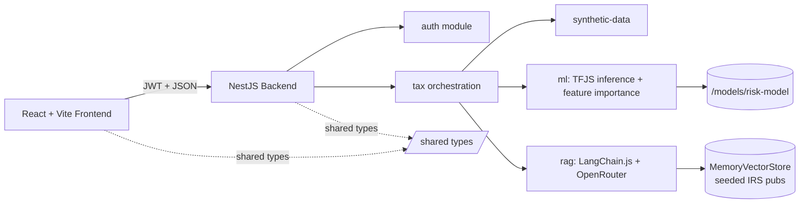

# System Patterns

> **Architecture, key technical decisions, design patterns, component relationships.**

## High-Level Architecture

## Backend Module Layout (NestJS, SOLID)

Each module has a single responsibility:

| Module           | Responsibility                                                                                                                     |
| ---------------- | ---------------------------------------------------------------------------------------------------------------------------------- |
| `auth`           | JWT issuance + guard. In-memory demo users.                                                                                        |
| `synthetic-data` | Faker + statistical rules → realistic mock 1040 returns with fairness metadata (`ageGroup`, `gender`, `ethnicity`).                |
| `ml`             | Loads exported TensorFlow.js model, runs inference, computes feature attribution (integrated gradients or permutation importance). |
| `rag`            | LangChain.js chain: OpenRouter embeddings → MemoryVectorStore over seeded IRS pubs → free Llama 3.3 70B for grounded explanations. |
| `tax`            | Orchestration controller. Synthetic → predict → RAG. Single REST entry point.                                                      |

## Frontend Layout (Feature-Sliced)

- `/frontend/src/features/<feature>/` — vertical slices (upload, results, fairness, auth).
- `/frontend/src/components/ui/` — shadcn/ui primitives.
- `/frontend/src/lib/` — API client, query keys, helpers.
- `@/*` path alias for all internal imports.
- TanStack Query for all server state.
- Recharts for visualizations.

## Shared Types

`/shared/` exports DTOs and Zod schemas used by both backend and frontend. **Never duplicate types** across the two sides — import from `@irs/shared`.

## Key Patterns / Conventions

1. **Validation at the boundary.** Every controller method validates input via Zod + class-validator. Internal services trust their inputs.
2. **Feature attribution travels with every prediction.** API never returns just a score.
3. **RAG explanation is conditional.** Only attached when `risk > threshold`, to keep latency tight on low-risk paths.
4. **Fairness metrics on every response.** Demographic parity + equal opportunity are computed at predict time and returned.
5. **FedRAMP-style comments.** Every file touching auth, validation, or data persistence has a header comment noting privacy/data-handling constraints.
6. **Conventional commits.** `feat:`, `fix:`, `refactor:`, `test:`, `docs:`. Atomic, tested, revertible.
7. **Class-based dark mode** wired in, but only light mode exposed in UI (per locked decision).

## Data Flow (Single Prediction)

1. Client `POST /api/predict` with auth header + return payload.
2. JWT guard validates.
3. Zod/class-validator validates payload shape.
4. `tax` controller calls `ml.predict(payload)` → `{score, importance}`.
5. If `score > threshold`, `tax` calls `rag.explain(payload, importance)` → `{summary, citations[]}`.
6. `tax` calls `fairness.metrics(payload, score)` → `{demographicParity, equalOpportunity}`.
7. Response: `{score, importance, explanation?, citations?, fairness}`.

## Deployment Patterns

- **Local:** `docker compose up` — backend + frontend containers, multi-stage Dockerfiles.
- **Cloud:** Render.com free tier via `render.yml` Blueprint. Backend = Web Service (Docker). Frontend = Static Site. CI/CD on every push to `main`. See [`docs/deployment.md`](../docs/deployment.md).

## Authoritative References

- Full PRD with epic breakdown: [`docs/PRD.md`](../docs/PRD.md)
- Tech stack and locked choices: [`memory-bank/techContext.md`](./techContext.md)
- Workflow rules: [`CLAUDE.md`](../CLAUDE.md)
